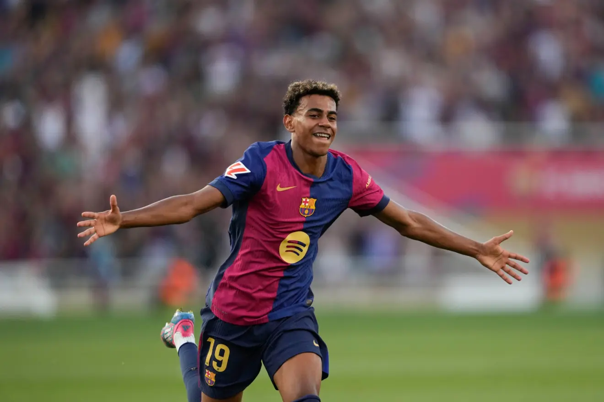
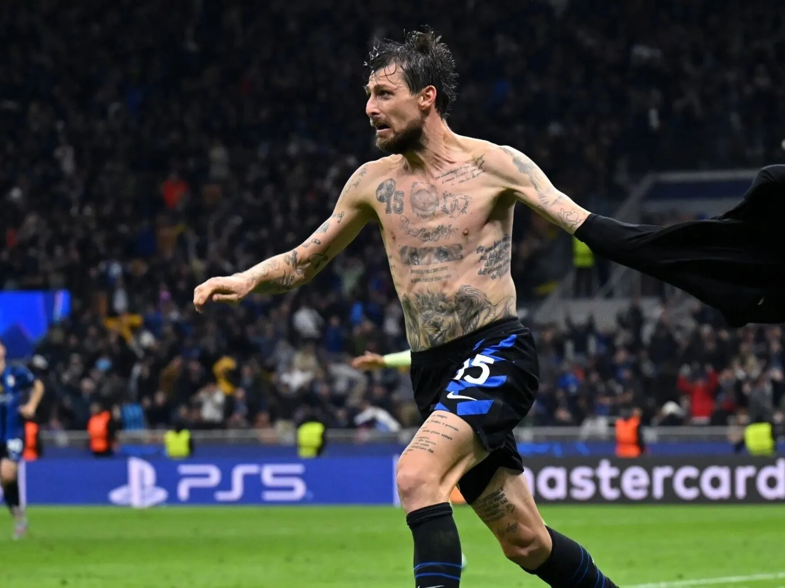
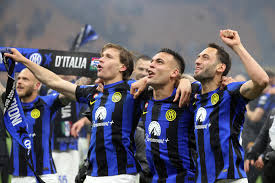
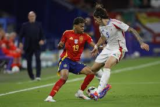

# Barcelona vs Inter de Milán – Semifinal UEFA Champions League 2025

Las semifinales entre FC Barcelona e Inter de Milán fue una de las más emocionantes de la temporada 2024/25, dejando momentos históricos, goles espectaculares y actuaciones individuales memorables.

# Partido de Ida: Montjuïc

El primer encuentro terminó 3-3 en un duelo vibrante:

- Goles de Yamal, Ferran y Raphinha para el Barça.
- Lautaro, Barella y Calhanoglu anotaron para el Inter.

**Momentos destacados:**
- Lamine Yamal marcó un golazo y asistió en otro.
- El Barça dominó la posesión pero no pudo cerrar el partido.

Lista de incidencias importantes:
1. Gol de Yamal a los 18 minutos.
2. Inter empató en el 91'.

[Resumen oficial del partido](https://www.uefa.com/uefachampionsleague/news/028d-123456789abc/)
[Crónica en Marca](https://www.marca.com/futbol/champions-league/barcelona-vs-inter.html)

# Partido de Vuelta: San Siro

En la vuelta, el Inter se impuso 4-3 tras prórroga y se metió en la final con un global de 7-6.

- Francesco Acerbi empató en el último minuto.
- Davide Frattesi marcó el gol definitivo en tiempo extra.

Lista de claves del partido:
- Remontada del Inter tras ir 2 goles abajo.
- La defensa del Barça colapsó en el alargue.

[Crónica de AS](https://as.com/futbol/champions/inter-barcelona-vuelta/)
[Análisis táctico de Mundo Deportivo](https://www.mundodeportivo.com/inter-barcelona-analisis.html)

# Figura del cruce: Lamine Yamal

A sus 17 años, el joven español fue la gran figura:

- 1 gol, 1 asistencia y 2 tiros al travesaño en la ida.
- Rompió el récord de jugador más joven en marcar en semifinales de Champions.

[Perfil de Yamal en UEFA](https://www.uefa.com/uefachampionsleague/clubs/players/2603938/)
[Opinión de Zidane sobre Yamal](https://www.lequipe.fr/football/lamine-yamal-zidane-declaraciones.html)

# Conclusión

El FC Barcelona mostró gran nivel ofensivo, pero no logró sostener la ventaja. El Inter, con experiencia y contundencia, dio el golpe y se metió en la gran final.
