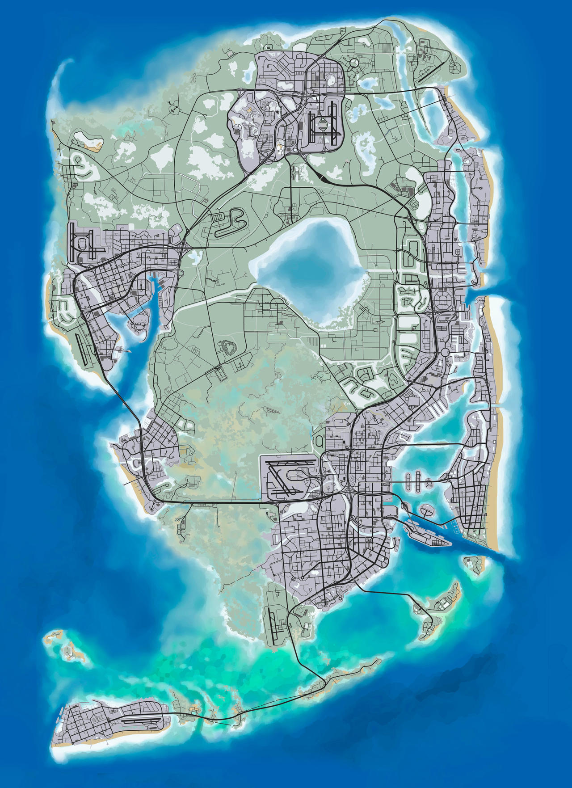

# GTAVI

## Análisis del 2do Trailer

En tan solo 7 horas, el tráiler del Grand Theft Auto VI (GTA VI) alcanzó 29 millones de reproducciones en YouTube. Un número que lo dice todo: el próximo videojuego de Rockstar Games es uno de los más esperados en el mundo gamer.

El adelanto revela detalles de la relación entre el dúo protagónico, una especie de Bonnie and Clyde modernos. Además, sorprende el nivel visual que tendrá esta nueva entrega.

## Gráficos mejorados

El nuevo tráiler muestra los impresionantes gráficos del juego y detalla parte de la trama principal. Se observa lo realista que es el motor gráfico del nuevo GTA.

Por ejemplo, en una escena se pueden ver burbujas dentro de una botella de cerveza sobre una mesa, lo que refleja el nivel de detalle que Rockstar está implementando.

## Nuevos personajes

Los nuevos personajes confirmados por Rockstar son:

- **Lucía Caminos**: “Recién salida de prisión y lista para cambiar las tornas a su favor. Está decidida a cumplir su plan cueste lo que cueste.”
  
- **Jason Duval**: “Quiere una vida fácil, pero todo se complica. Conocer a Lucía podría ser lo mejor o lo peor que le haya pasado.”

## Nuevas mecánicas

### Nueva IA en los NPCs

- La inteligencia artificial será mucho más avanzada.
- Los NPCs reaccionarán de forma realista al entorno y entre sí.
- Se espera una simulación social más compleja: ciudadanos con celulares, rutinas diarias, etc.

### Nuevo mapa

El mapa estará ambientado en Vice City (una versión de Miami), con zonas rurales, pantanos, y un ecosistema vivo y cambiante.

## Enlaces útiles

- [Tráiler oficial en YouTube](https://www.youtube.com/watch?v=QdBZY2fkU-0)
- [Sitio oficial de Rockstar Games](https://www.rockstargames.com)
- [Noticias sobre GTA VI en IGN](https://www.ign.com/games/grand-theft-auto-vi)
- [Foro de discusión en Reddit](https://www.reddit.com/r/GTA6/)
- [Resumen en Wikipedia](https://es.wikipedia.org/wiki/Grand_Theft_Auto_VI)