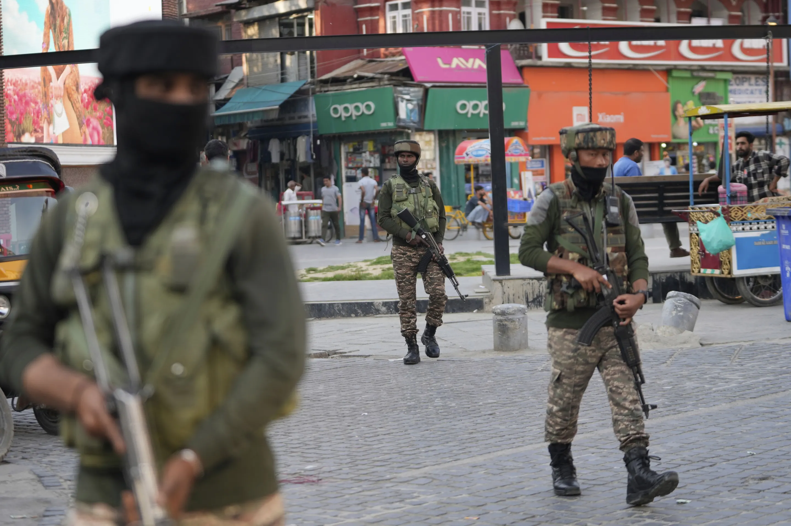
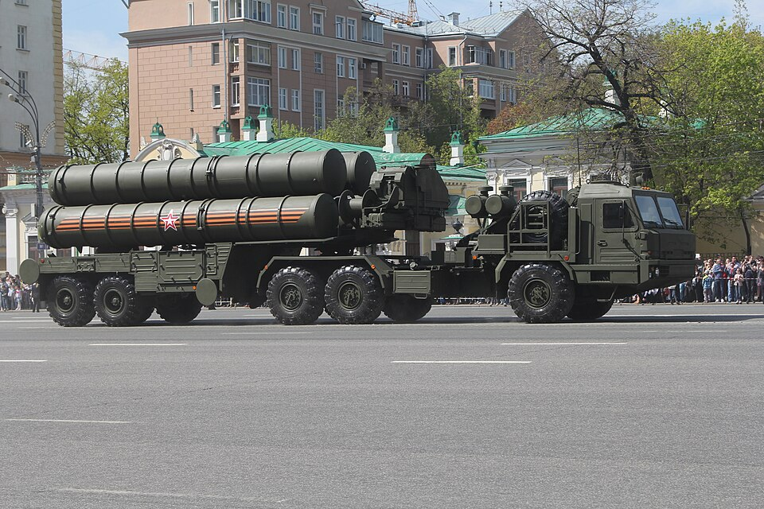
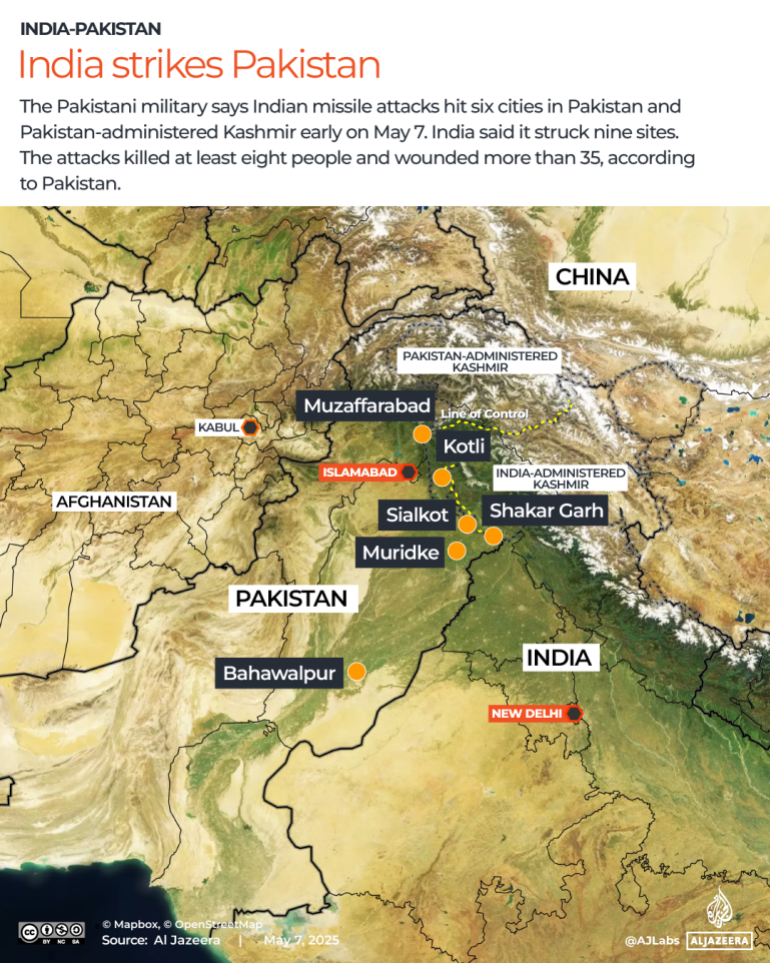
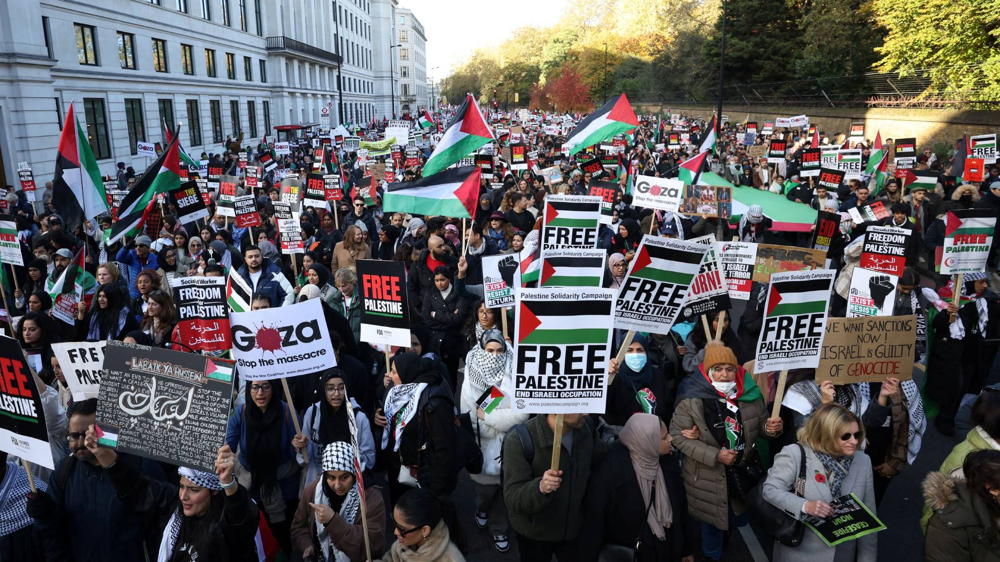

# 🇮🇳🇵🇰 Escalada Bélica entre India y Pakistán: ¿Al Borde de una Guerra Nuclear?

El 7 de mayo de 2025, India lanzó la "Operación Sindoor", una serie de ataques aéreos con misiles dirigidos a supuestos campamentos terroristas en Pakistán y en la región de Cachemira administrada por Pakistán.

Estos ataques fueron en represalia por un atentado ocurrido el 22 de abril en Pahalgam, que dejó 28 civiles muertos, en su mayoría turistas hindúes.

Pakistán respondió afirmando haber derribado cinco aviones de combate indios y varios drones. Además, lanzó ataques con drones y misiles contra ciudades indias como Amritsar, los cuales fueron interceptados por el sistema de defensa aérea S-400 de India.

## 🛡️ Detalles de la "Operación Sindoor"
- **Fecha**: 7 de mayo de 2025
- **Duración**: 23 minutos
- **Objetivos**: Campamentos de grupos como Jaish-e-Mohammed y Lashkar-e-Taiba
- **Ubicaciones atacadas**: Bahawalpur, Muridke, Muzaffarabad, Kotli, entre otras
- **Resultados según India**: Más de 100 militantes eliminados

## ⚔️ Respuesta de Pakistán
- **Derribo de aeronaves**: 5 aviones de combate indios y varios drones
- **Ataques con drones y misiles**: Dirigidos a ciudades indias, interceptados por sistemas de defensa
- **Declaraciones oficiales**: El Ministro de Defensa, Khawaja Asif, advirtió sobre la posibilidad de una guerra nuclear

## 🌍 Reacciones Internacionales
- **ONU**: Llamado urgente a la desescalada del conflicto
- **EE.UU. y Reino Unido**: Instan a la moderación y ofrecen mediar en las negociaciones
- **Protestas globales**: Manifestaciones en ciudades como Londres y Nueva York en contra de una posible guerra

## 🔗 Enlaces de Interés
1. [CNN en Español: Conflicto India-Pakistán](https://cnnespanol.cnn.com/mundo/live-news/noticias-india-pakistan-conflicto-2-trax)
2. [The Guardian: Escalada en Cachemira](https://www.theguardian.com/world/live/2025/may/08/india-pakistan-kashmir-latest-live-news)
3. [Wikipedia: Ataques de India contra Pakistán de 2025](https://es.wikipedia.org/wiki/Ataques_de_India_contra_Pakist%C3%A1n_de_2025)
4. [El País: Claves del conflicto India-Pakistán](https://elpais.com/internacional/2025-05-08/claves-la-india-y-pakistan-un-conflicto-de-raiz-colonial-con-epicentro-en-la-disputada-cachemira.html)
5. [CNN Video: Antecedentes históricos del conflicto](https://cnnespanol.cnn.com/2025/05/07/mundo/video/antecedentes-historicos-conflicto-india-pakistan-cafe-tv)
