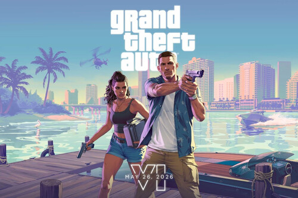
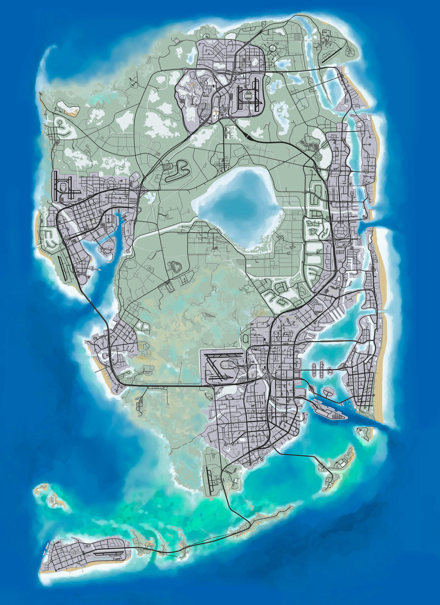
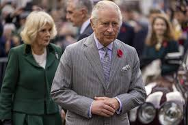

<<<<<<< HEAD
# git-practice-20251C
Trabajo Práctico en Git del Taller

## Índice
1. Habemus Papam
2. GTAVI
3. River
4. Ficha Limpia
5. Colapinto F1
6.Estados unidos vs China
7. India vs Pakistan
8. depositos minerales
9. Guerra nuclear India Pakistan
10. Jero correa
11. New York Knicks vs. Boston Celtics

# Habemus Papam

## Nuevo Papa en el Vaticano, estadounidense Robert Prevost y se llamará León XIV

- En la cuarta votación del Cónclave los 133 cardenales eligieron al nuevo pontífice.
- A las 14.10 se anunció el nombre y minutos después se asomó a saludar a la multitud.
- En su primer mensaje, llamó a la paz y la unidad y destacó el papado de Francisco.
- Seguí todas las novedades en la cobertura minuto a minuto de Clarín.

El Cónclave eligió al nuevo Papa que sucederá a Francisco al frente de la Iglesia. Se trata del estadounidense Robert Prevost (69), que se llamará León XIV. Un total de 133 cardenales participaron del segundo día de votación y en la cuarta elección se consiguieron los votos necesarios. En su primer mensaje, hizo una llamado a la paz y la unidad y le agradeció al pontífice argentino. Seguí todas las novedades en la cobertura minuto a minuto de Clarín.

### Habemus papam: hubo fumata blanca en el Vaticano y se espera el anuncio del sucesor de Francisco

- El francés Dominique Mamberti tuvo el honor de pronunciar la famosa fórmula latina al final del cónclave.
- Su historia y su relación con el papa Francisco.

Los cardenales no se pusieron de acuerdo en las tres primeras votaciones. Ahora resta conocer el nombre de quién sucederá al último papa

Finalmente, la fumata blanca se hizo presente en el Vaticano este jueves de la chimenea instalada en el tejado de la Capilla Sixtina, señal que los 133 cardenales encerrados en su interior lograron escoger al sucesor del papa Francisco en el segundo día del cónclave.

### La película que marca tendencia con la elección de Robert Prevost como el nuevo Papa

La película "Habemus Papam" vuelve a cobrar sentido tras la elección de Robert Prevost como el nuevo Papa, quien adoptará el nombre de León XIV. Dónde verla.

"Habemus Papam", la expresión latina que anuncia la llegada de un nuevo líder espiritual al frente de la Iglesia Católica ha resonado nuevamente tras la elección de Robert Prevost como el Papa, quien adoptará el nombre de León XIV. La emblemática fumata blanca emergió desde la chimenea de la Capilla Sixtina, marcando el fin de un periodo de incertidumbre tras el fallecimiento del papa Francisco.

La ficción se entrelaza con la realidad en esta comedia dramática que explora con ternura y agudeza el interior del Vaticano durante el cónclave. En medio del encierro sagrado, donde los cardenales deben decidir quién será el nuevo representante de Dios en la Tierra, Moretti plantea una pregunta tan sencilla como disruptiv

a: ¿y si el nuevo Papa no quisiera serlo?

---

# GTAVI

## Análisis del 2do Trailer

En tan solo 7 horas, el tráiler del Grand Theft Auto VI (GTA VI) alcanzó 29 millones de reproducciones en YouTube. Un número que lo dice todo: el próximo videojuego de Rockstar Games es uno de los más esperados en el mundo gamer.

El adelanto revela detalles de la relación entre el dúo protagónico, una especie de Bonnie and Clyde modernos. Además, sorprende el nivel visual que tendrá esta nueva entrega.

## Gráficos mejorados

El nuevo tráiler muestra los impresionantes gráficos del juego y detalla parte de la trama principal. Se observa lo realista que es el motor gráfico del nuevo GTA.

Por ejemplo, en una escena se pueden ver burbujas dentro de una botella de cerveza sobre una mesa, lo que refleja el nivel de detalle que Rockstar está implementando.

## Nuevos personajes

Los nuevos personajes confirmados por Rockstar son:

- **Lucía Caminos**: “Recién salida de prisión y lista para cambiar las tornas a su favor. Está decidida a cumplir su plan cueste lo que cueste.”
  
- **Jason Duval**: “Quiere una vida fácil, pero todo se complica. Conocer a Lucía podría ser lo mejor o lo peor que le haya pasado.”

## Nuevas mecánicas

<<<<<<< HEAD
# River
El Club Atlético River Plate fue fundado el **25** de mayo de **1901** en Buenos Aires, Argentina. A lo largo de su historia, se convirtió en uno de los clubes más exitosos del país y del continente.

Desde sus inicios en el barrio de La Boca hasta su traslado a Núñez, River ha construido una identidad marcada por el fútbol ofensivo, la cantera de grandes jugadores y una rivalidad histórica con Boca Juniors.
=======
### Nueva IA en los NPCs

- La inteligencia artificial será mucho más avanzada.
- Los NPCs reaccionarán de forma realista al entorno y entre sí.
- Se espera una simulación social más compleja: ciudadanos con celulares, rutinas diarias, etc.

### Nuevo mapa

El mapa estará ambientado en Vice City (una versión de Miami), con zonas rurales, pantanos, y un ecosistema vivo y cambiante.

## Enlaces útiles

- [Tráiler oficial en YouTube](https://www.youtube.com/watch?v=QdBZY2fkU-0)
- [Sitio oficial de Rockstar Games](https://www.rockstargames.com)
- [Noticias sobre GTA VI en IGN](https://www.ign.com/games/grand-theft-auto-vi)
- [Foro de discusión en Reddit](https://www.reddit.com/r/GTA6/)
- [Resumen en Wikipedia](https://es.wikipedia.org/wiki/Grand_Theft_Auto_VI)

---
  
# El Senado rechazó la Ficha Limpia: continúa la impunidad de Cristina Kirchner

## La casta kirchnerista no permitió llegar a una mayoría absoluta por un solo voto.

El **Senado rechazó** por apenas un voto la sanción definitiva de la **ley de Ficha Limpia**, una iniciativa clave que impulsaba la inhabilitación de candidatos con condena firme en segunda instancia por delitos contra la administración pública. El proyecto, que contaba con amplio respaldo ciudadano y del gobierno nacional encabezado por Javier Milei, **cosechó 36 votos afirmativos**, uno menos que la mayoría absoluta de **37 necesaria para su aprobación.**

- 36 afirmativos
- 37 negativos 

# La sorpresa

El resultado fue sorpresivo hasta el último momento. Si bien el rechazo del bloque kirchnerista era previsible, el inesperado alineamiento de los senadores misioneros **Carlos Arce y Sonia Rojas Decut** —ambos del **Frente Renovador de la Concordia**, no vinculados a **Sergio Massa**— terminó por sepultar la norma que amenazaba, entre otros, con impedir una eventual candidatura nacional de **Cristina Fernández de Kirchner**, condenada en segunda instancia por **corrupción.**
Dos personas sentadas en sillas de madera en un entorno formal con documentos y dispositivos electrónicos sobre la mesa."

# Explicacion

**La ley Ficha Limpia** buscaba modificar las condiciones de elegibilidad para cargos electivos y ejecutivos, estableciendo la **inelegibilidad de quienes hubieran sido condenados en segunda instancia por delitos como fraude al Estado** (art. 174, inc. 5), cohecho, malversación, enriquecimiento ilícito y otros ilícitos penales tipificados en el Título XI del Código Penal. La norma también contemplaba casos de enriquecimiento ilícito conforme al artículo 36 de la **Constitución Nacional.**

# La pelea

El gobierno libertario, a través de su bloque en el Senado, respaldó con firmeza el proyecto. **“Es necesario para la salud de la democracia”**, afirmó el sanjuanino **Bruno Olivera Lucero** (LLA), quien denunció **“maniobras para frenarla”** y describió la batalla legislativa como **“una lucha cuesta arriba”.**

# Cerrando...

El respaldo más enfático vino del presidente del bloque libertario, **Ezequiel Atauche** (Jujuy), quien advirtió: **“Un corrupto no tiene idoneidad para un cargo público. Es muy triste que tengamos que estar reforzando la Constitución para poder tener gente apta dentro del Estado”**. En línea con el discurso anticasta del oficialismo, Atauche sentenció: **“El argentino está cansado de hacer un esfuerzo grande y que se convierta en dinero para los bolsillos de los políticos”.**

Como votaron:

A favor

- Abad, Maximiliano
- Abdala, Bartolomé
- Alvarez Rivero, Carmen
- Arrascaeta, Ivanna
- Espinola, Carlos
- Atauche, Ezequiel
- Fama, Flavio Sergio
- Bedia, Vilma Facundo
- Gadano, Natalia
- Galaretto, Eduardo
- Ávila, Beatriz Luisa
- Blanco, Pablo Daniel
- Carambia, José María.
- Juez, Luis Alfredo
- Crexell, Carmen Lucia
- Cristina, Andrea
- Juri, Mariana
- De Angeli, Alfredo
- Kroneberger, Daniel
- Goerling Lara, Enri
- Losada, Carolina
- Romero, Juan Carlos
- Lousteau, Martin
- Silva, Mónica Esther
- Suárez, Rodolfo
- Tagliaferri, Guadalupe
- Olalla de Moreira, Stella Maris
- Valenzuela, Mercedes
- Olivera Lucero, Bruno
- Vigo, Alejandra María
- Pagotto, Juan Carlos
- Vischi, Eduardo
- Paoltroni, Francisco
- Zimmermann, Victor
- Terenzi, Edith Elizabeth
- Huala, María Victoria

En Contra:

- Di Tullio, Juliana
- Donate, Claudio
- Duré, María Eugenia
- Andrada, Guillermo
- Fernández Sagasti, Anabel
- Arce, Carlos Omar
- García Larraburu, Silvina
- Giménez Navarro, María Celeste
- Cora, Stefanía
- Corpacci, Lucia
- Gimenez, Nora del Valle
- Kirchner, Alicia
- De Pedro, Eduardo
- González, María
- Leavy, Sergio
- Parrilli, Oscar
- Ledesma, Claudia
- Pilatti Vergara, María Inés
- Lewandowski, Marcelo
- Recalde, Mariano
- Linares, Carlos Alberto
- Rejal, Jesús Fernando
- López, Cándida Cristina
- Rodas, Antonio
- López, María Florencia
- Rojas Decut, Sonia
- Salino, Fernando
- Manzur, Juan Luis
- Sapag, Silvia Estela
- Mayans, José
- Mendoza, Sandra
- Moisés, María Carolina
- Montenegro, Gera
- Uñac, Sergio
- Neder, José Emilio

Fuentes:

[La Nacion](https://www.lanacion.com.ar/politica/el-kirchnerismo-festejo-el-fracaso-de-la-ficha-limpia-mientras-cristina-sigue-pensando-en-una-nid07052025/)

[Infobae](https://www.infobae.com/politica/2025/05/07/ficha-limpia-en-vivo-las-ultimas-noticias-sobre-la-votacion-en-el-senado-minuto-a-minuto/)

[Derecha Diario](https://derechadiario.com.ar/politica/senado-rechazo-ficha-limpia-y-continua-impunidad-cristina-kirchner)

[C5N](https://www.c5n.com/politica/debate.senado-ficha-limpia-7-mayo-2025)

[TN](https://tn.com.ar/politica/2025/05/07/senado-el-oficialismo-y-los-bloques-aliados-consiguieron-quorum-y-arranca-la-sesion-por-ficha-limpia/)
=======

# Por qué Franco Colapinto tiene solo cinco carreras confirmadas con Alpine en la Fórmula 1: qué debe pasar para que complete el año
## Los motivos por los que el piloto argentino por ahora no tiene asegurado el resto de la temporada como titular con el equipo francés. Sin embargo, hay razones para ilusionarse y que pueda llegar a final del campeonato

# Franco Colapinto volverá a correr
Franco Colapinto volverá a correr en F1, pero en principio tiene asegurado solo los próximos cinco Grandes Premios (Bullet Sport Management)
Franco Colapinto volverá a correr en la Fórmula 1 ya que fue confirmado como piloto titular en Alpine y debutará en el Gran Premio de la Emilia Romaña, en el Autódromo Enzo y Dino Ferrari de Imola, Italia, el próximo 18 de mayo. Aunque lo que llamó la atención fue su contrato por solo cinco carreras. Hay una explicación.

Alpine mostró el detrás de escena de la presentación que tendrá Franco Colapinto en la transmisión de la Fórmula 1
De momento hay un fuerte hermetismo en el entorno de Colapinto, más allá de los correspondiente posteos en los que celebraron la confirmación del retorno de Franco a las carreras. El primer dato clave en este análisis es que se trata de una escudería que está bajo el ala de una fábrica, Renault. En estos ámbitos, ciertas decisiones de modificar los puestos de trabajo son más complejas que las de un equipo que no tiene una terminal detrás. Por ejemplo, Red Bull es una estructura deportiva que pertenece a la firma de bebidas energizantes, pero en sus movimientos de pilotos cuenta con más agilidad y sirven como muestra los habituales cambios.

En este caso de trata del Grupo Renault que tiene una serie de fábricas y una de ellas es Alpine. En ocasiones, subir o bajar a un piloto no implica en lo formal que quien pierde su lugar quede desafectado de forma definitiva. Pueden haber temas legales internos que hacen más complejo todo. No como el ejemplo de Red Bull con su conocido “sube y baja” de pilotos o eventuales desvinculaciones súbitas como la de Daniel Ricciardo tras la 16º fecha de 2024. Por eso Jack Doohan volvió a ser piloto de reserva a diferencia del caso Logan Sargeant -otro que reemplazó Colapinto- y que tras su salida como titular en Williams se desvinculó del equipo inglés.

En este panorama sirve el dato de que Colapinto será el primer argentino en 47 años en correr en la F1 representando a una fábrica. El último fue Carlos Alberto Reutemann con Ferrari en 1978. En el caso de Franco el tema no termina en Enstone, donde está la base de Alpine, en Viry Chatillón, la fábrica de motores de los autos de F1 ni en Boulogne-Billancourt, la sede central de Renault. Por caso, su filial argentina se hizo eco del reingreso como titular del bonaerense y también lo hizo con otras novedades pertinentes a Franco.

# El anuncio de Alpine sobre Franco Colapinto (@AlpineF1Team)

# Nuevo director de equipo
El segundo tema pasa por una estrategia de suavizar el momento. Se viene del cimbronazo de la renuncia de Oliver Oakes en el cargo de director de equipo y más allá de que Flavio Briatore afirmó que se debió a un tema personal, Oakes siempre defendió la continuidad de Doohan como titular. El anuncio de las “5 carreras de Colapinto” tiene tintes políticos y más cuando se trata de un contexto de una terminal. De pronto hubiese tenido poco tacto informar para el afuera que el argentino tenía confirmada el resto de la temporada luego de sacar a Doohan tras solo seis eventos. Quizá la noticia de continuidad de Colapinto por el resto del año llegue más adelante.

Briatore llegó a Alpine a mediados del año pasado de la mano del CEO del Grupo Renault, Luca De Meo, el autor del célebre “vamos nene”, en el momento del ingreso de Colapinto a Alpine el pasado 9 de enero. Flavio, tal vez, debió recurrir a un anuncio que tenga esta aclaración sobre la cantidad de carreras para intentar amortiguar unas 24 horas frenéticas tras la dimisión de Oakes, quien a su vez fue reemplazado en su puesto por el propio Briatore...

Si de política y de manejo de relaciones se trata, cabe recordar que Briatore pasó de ser instructor de esquí a surfear en el mundo de la alta costura al ser amigo de Luciano Benetton y de su mano llegó a la F1, donde comenzó siendo responsable comercial de Benetton, que hoy es la esencia de Alpine ya que la base es la misma de Enstone. Bajo las órdenes del italiano, el equipo logró sus únicos títulos de Pilotos con Michael Schumacher en 1994 y 1995 (ese años también obtuvo el de Constructores). Además, ya bajo la denominación de Renault, se consagraron con Fernando Alonso en 2005 y 2006, y también celebraron en Constructores. La carrera de los mencionados pilotos en F1 estuvo marcada en sus inicios por Briatore, como lo que ocurre hoy con Colapinto. Cabe recordar que Il Padrino también fue indultado por la Federación Internacional del Automóvil (FIA) y la F1 luego de ser el responsable del “Crashgate”, el mayor escándalo en la historia de la Máxima

“Tras analizar las primeras carreras de la temporada, hemos tomado la decisión de poner a Franco en el coche junto a Pierre durante las próximas cinco carreras. Con una parrilla tan igualada este año, y con un coche competitivo, que el equipo ha mejorado drásticamente en los últimos 12 meses, estamos en una posición en la que vemos la necesidad de rotar nuestra alineación”, indicó el empresario italiano en el comunicado difundido en la madrugada argentina.

# El motivador mensaje de Colapinto tras ser confirmado en Alpine
Y añadió: “También sabemos que la temporada 2026 será importante para el equipo y hacer una evaluación completa y justa de los pilotos esta temporada es lo correcto para maximizar nuestras ambiciones el año que viene. Seguimos apoyando a Jack en el equipo, ya que ha actuado de manera muy profesional en su papel de piloto de carreras en lo que va de temporada. Las próximas cinco carreras nos darán la oportunidad de probar algo diferente y después de este periodo de tiempo evaluaremos nuestras opciones”.

Por otro lado, si en realidad se trata de una supuesta evaluación interna con los pilotos que tiene el equipo, por los antecedentes que tiene Colapinto no debería generarse preocupación de parte de la afición argentina. Se trata de un corredor que tuvo nueve Grandes Premios en 2024, en los que sumó puntos desde su segunda carrera y en un circuito desafiante como el de Bakú en Azerbaiyán, que además era desconocido para el pilarense. Luego también cosechó una unidad en Austin, otro lugar nuevo -en ese momento- para Franco. Cabe recordar que en el circuito estadounidense podría haber sumado el punto extra por marcar el récord de vuelta, pero Alpine, que peleaba su posición en el Campeonato de Constructores con Williams, le puso gomas nuevas al auto de Esteban Ocon y se quedó con esa marca en el último giro, pero no cosechó esa unidad porque terminó detrás de los diez primeros.

El único error que puede achacársele a Colapinto y de manera relativa fue su accidente en la clasificación en Las Vegas, pero cabe recordar que el propio jefe de Williams, James Vowles, reconoció la responsabilidad del team inglés. En Interlagos, San Pablo, Franco se expuso a su primera experiencia bajo la lluvia y en el momento de su accidente fue cuando más fuerte precipitó. Fue una mala fortuna para él. Y en Qatar fue chocado por el propio Ocon.

Además, Colapinto tiene algo a favor que es su rápido adaptación, cuyos motivos se los confesó a Infobae en una rueda de prensa el año pasado: “Salvo excepciones, nunca tuve plata para hacer pruebas en las categorías menores y por eso cada vez que me subía al coche en los entrenamientos oficiales del fin de semana me exigía al máximo”. Por eso no deberían haber problemas para que tras la primera práctica libre en Imola le agarre la mano al Alpine A525.

Briatore habría pagado 20 millones
Briatore habría pagado 20 millones de dólares por la cesión de Colapinto. ¿Tanto dinero por solo cinco GGPP? (@briatoreflavio)
Además de Imola, luego Franco tendrá otros cuatro Grandes Premios en Mónaco (25/5), España (1/06), Canadá (15/06) y Austria (29/06) confirmados para mostrar que está capacitado para continuar como principal. El único circuito que desconoce es el Gilles Villeneuve canadiense y en el resto corrió con categorías promocionales. De hecho, el lugar de su debut con Alpine lo tuvo como vencedor en Fórmula 2 y Fórmula 3. Si Colapinto logra sumar puntos en alguna de esas competencias y puede superar a su compañero de equipo Pierre Gasly o no estar tan lejos como el caso de Doohan, el pilarense pondrá sus cartas sobre la mesa, siempre y cuando exista de verdad una evaluación interna entre los corredores de Alpine.

Pueden haber formas, estilos, o un lenguaje específico para transmitir un mensaje. A la hora de decodificar lo comunicado este miércoles por Alpine, se advierte un objetivo de calmar las aguas y ganar tiempo. Porque, ¿acaso el propio Briatore habría pagado 20 millones de dólares para que Colapinto corra solo cinco Grandes Premios? Cabe recordar que ese habría sido el importe que Il Padrino debió poner para lograr la cesión de cinco años de parte de Williams para hacerse de los servicios del argentino.

Desde ya que Franco Colapinto estará bajo la lupa desde su primera salida a pista en el Autódromo Enzo y Dino Ferrari de Imola. Que será comparado todo el tiempo con su compañero Gasly. Pero así como esa especie de fábula con su repentino bautismo en carrera el 1 de septiembre de 2024 en Monza, el día que se atrevió a efectuar sobre pasos ante pilotos que corrieron todo el año y con muchísima experiencia, el corredor bonaerense invita a soñar para que pueda completar la temporada

Carreras en las que esta confirmado que correrá Colapinto:
- Emilia-Romaña - 18/05
- Mónaco - 25/05
- España - 01/06
- Canadá - 15/06
- Austria - 29/06

Carreras en las que podra correr Colapinto si tiene buen rendimiento:
- Gran Bretaña - 06/07
- Bélgica - 27/07
- Hungría - 03/08
- Países Bajos - 31/08
- Italia - 07/09
- Azerbaiyán - 21/09
- Singapur - 05/10
- Estados Unidos - 19/10
- México - 26/10
- Brasil - 09/11
- Las Vegas - 22/11
- Catar - 30/11
- Abu Dabi - 07/12

Si querés leer mas sobre Colapinto y su futuro en la F1, aca hay noticias de otros medios:

[TN](https://tn.com.ar/deportes/automovilismo/2025/05/08/la-primera-evaluacion-de-alpine-tras-designar-a-franco-colapinto-como-piloto-titular-de-formula-1)

[TyC Sports](https://www.tycsports.com/automovilismo/el-divertido-detras-de-escena-de-la-grabacion-de-colapinto-para-la-f1-id656059.html)

[La Nacion](https://www.lanacion.com.ar/deportes/automovilismofranco-colapinto-el-desafio-de-sortear-la-presion-y-la-ayuda-de-conocer-cuatro-circuitos-en-la-nid08052025/)

[La Gaceta](https://www.lagaceta.com.ar/nota/1082369/deportes/tras-anuncio-regreso-formula-1-colapinto-se-subio-al-alpine-paises-bajos.html)

[Ambito](https://www.ambito.com/deportes/flavio-briatore-explico-la-decision-alpine-del-regreso-franco-colapinto-la-formula-1-n6142352)

# Estados Unidos y China buscan rebajar tensiones comerciales en su primer cara a cara en Suiza

## Beijing ha sidio uno de los grandes objetivos de la guerra comercial, en la que el régimen chino respondió a los aranceles de Trump con una tarifa del 125 %

- China y Estados Unidos buscarán rebajar la tensión en su primer encuentro oficial desde el comienzo de la guerra comercial, que tendrá lugar este fin de semana en Suiza tras semanas de reproches mutuos y nuevas barreras arancelarias que han deteriorado aún más su relación bilateral.
- El país asiático confirmó este miércoles que el vice primer ministro He Lifeng encabezará la delegación china en las conversaciones comerciales, en las que el secretario del Tesoro, Scott Bessent, representará a Estados Unidos.

- [Infobae](https://www.infobae.com/america/mundo/2025/05/08/estados-unidos-y-china-buscan-rebajar-tensiones-comerciales-en-su-primer-cara-a-cara-en-suiza/)

# Tiembla Estados Unidos

## El gobierno de Donald Trump acusó a China de golpear a una fuerte industria del país por prácticas desleales.

# El sector textil: el más golpeado por la guerra comercial con China

### La guerra arancelaria entre Estados Unidos y China tuvo un impacto considerable en la industria textil estadounidense. Al imponer aranceles a productos textiles y materias primas provenientes de China, uno de los principales proveedores globales, muchas empresas experimentaron un aumento en los costos de producción.

# ¿Cuáles son las políticas desleales chinas que acusa el gobierno de Estados Unidos?

### Según un artículo de la Oficina del Representante Comercial de Estados Unidos (USTR), "más del 30 % de todos los envíos diarios de minimis a Estados Unidos provinieron de empresas chinas de comercio electrónico que inundaron el mercado con prendas de bajo costo, evitando aranceles y procedimientos de cumplimiento comercial".

- [El Cronista](https://www.cronista.com/usa/economia-y-finanzas/tiembla-estados-unidos-el-poderoso-sector-que-se-encuentra-en-crisis-por-la-guerra-comercial-con-china/)

# Tensión entre India y Pakistán

## Contexto Histórico
La rivalidad entre India y Pakistán tiene raíces profundas que se remontan a la partición de 1947. Ambos países han tenido conflictos recurrentes, incluyendo guerras y enfrentamientos fronterizos.

- [Historia de la partición](https://es.wikipedia.org/wiki/Partici%C3%B3n_de_la_India)
- [Conflictos entre India y Pakistán](https://es.wikipedia.org/wiki/Conflictos_entre_India_y_Pakist%C3%A1n)

---

## Principales Conflictos
1. **Primera Guerra de Cachemira (1947-1948):** Un conflicto armado por el control de la región de Cachemira.
2. **Guerra de Kargil (1999):** Un enfrentamiento en la región montañosa de Kargil.

- [Primera Guerra de Cachemira](https://es.wikipedia.org/wiki/Primera_guerra_de_Cachemira)
- [Guerra de Kargil](https://es.wikipedia.org/wiki/Guerra_de_Kargil)

---

## Impacto en la Región
### Consecuencias Humanitarias
- Miles de desplazados debido a los conflictos.
- Pérdidas económicas y sociales significativas.

### Tensiones Políticas
- Ambos países poseen armas nucleares, lo que aumenta el riesgo de un conflicto mayor.
- [Relaciones India-Pakistán](https://es.wikipedia.org/wiki/Relaciones_India-Pakist%C3%A1n)

---

## Perspectivas Futuraas
- **Diálogo Diplomático:** Se han realizado intentos de negociación, pero los avances son limitados.
- **Intervención Internacional:** La comunidad global sigue monitoreando la situación.

- [Resoluciones de la ONU](https://es.wikipedia.org/wiki/Resoluciones_de_la_ONU_sobre_Cachemira)
- [Noticias recientes](https://www.bbc.com/mundo)

<<<<<<< HEAD
>>>>>>> 8322eb4d4d127b530b3410a0f4060b25cb69e491
=======
<<<<<<< HEAD

# Hallaron uno de los mayores depósitos minerales del mundo entre Argentina y Chile
# Recursos Minerales en Filo del Sol y Josemaría
- 12,8 millones de toneladas de cobre medido
- 25,1 millones de toneladas de cobre inferido
- 32,2 millones de onzas de oro medido
- 48,7 millones de onzas de oro inferido
- 659 millones de onzas de plata medida
- 808 millones de onzas de plata inferida
# Empresas Involucradas en el Desarrollo
1. Exploración de Filo del Sol
2. Preconstrucción de Josemaría
3. Evaluación de recursos
4. Integración operativa de ambos yacimientos
5. Optimización de infraestructura
6. Expansión escalonada de producción
# Ubicación estratégica
## Ambos yacimientos están ubicados en la frontera entre Argentina (San Juan) y Chile (Atacama).
[Impacto mundial: encuentran en Argentina las mayores reservas de cobre, oro y plata de los últimos 30 años](https://www.clarin.com/economia/impacto-mundial-encuentran-argentina-mayores-reservas-cobre-oro-plata-ultimos-30-anos_0_FciNS6NCAZ.html)
[Hallaron uno de los mayores depósitos minerales del mundo entre Argentina y Chile](https://www.infobae.com/america/mundo/2025/05/05/hallaron-uno-de-los-mayores-depositos-minerales-del-mundo-entre-argentina-y-chile/)
[Hallazgo sin precedentes: Argentina tiene uno de los mayores depósitos de cobre, oro y plata del mundo](https://www.canal26.com/planeta/hallazgo-sin-precedentes-argentina-tiene-uno-de-los-mayores-depositos-de-cobre-oro-y-plata-del-mundo--422210)
[Lo que buscaban era cobre, pero hallaron oro: El descubrimiento que podría cambiar el destino minero de un país latinoamericano](https://es.gizmodo.com/lo-que-buscaban-era-cobre-pero-hallaron-oro-el-descubrimiento-que-podria-cambiar-el-destino-minero-de-un-pais-latinoamericano-2000164306)
[Un nuevo hallazgo de cobre, oro y plata sitúa a Argentina como nueva potencia minera](https://www.elperiodico.com/es/internacional/20250506/argentina-encamina-convertirse-potencia-minera-oro-plata-cobre-chile-mina-117104380)

=======
# 🇮🇳🇵🇰 Escalada Bélica entre India y Pakistán: ¿Al Borde de una Guerra Nuclear?

El 7 de mayo de 2025, India lanzó la "Operación Sindoor", una serie de ataques aéreos con misiles dirigidos a supuestos campamentos terroristas en Pakistán y en la región de Cachemira administrada por Pakistán.

Estos ataques fueron en represalia por un atentado ocurrido el 22 de abril en Pahalgam, que dejó 28 civiles muertos, en su mayoría turistas hindúes.

Pakistán respondió afirmando haber derribado cinco aviones de combate indios y varios drones. Además, lanzó ataques con drones y misiles contra ciudades indias como Amritsar, los cuales fueron interceptados por el sistema de defensa aérea S-400 de India.

## 🛡️ Detalles de la "Operación Sindoor"
- **Fecha**: 7 de mayo de 2025
- **Duración**: 23 minutos
- **Objetivos**: Campamentos de grupos como Jaish-e-Mohammed y Lashkar-e-Taiba
- **Ubicaciones atacadas**: Bahawalpur, Muridke, Muzaffarabad, Kotli, entre otras
- **Resultados según India**: Más de 100 militantes eliminados

## ⚔️ Respuesta de Pakistán
- **Derribo de aeronaves**: 5 aviones de combate indios y varios drones
- **Ataques con drones y misiles**: Dirigidos a ciudades indias, interceptados por sistemas de defensa
- **Declaraciones oficiales**: El Ministro de Defensa, Khawaja Asif, advirtió sobre la posibilidad de una guerra nuclear

## 🌍 Reacciones Internacionales
- **ONU**: Llamado urgente a la desescalada del conflicto
- **EE.UU. y Reino Unido**: Instan a la moderación y ofrecen mediar en las negociaciones
- **Protestas globales**: Manifestaciones en ciudades como Londres y Nueva York en contra de una posible guerra

## 🔗 Enlaces de Interés
1. [CNN en Español: Conflicto India-Pakistán](https://cnnespanol.cnn.com/mundo/live-news/noticias-india-pakistan-conflicto-2-trax)
2. [The Guardian: Escalada en Cachemira](https://www.theguardian.com/world/live/2025/may/08/india-pakistan-kashmir-latest-live-news)
3. [Wikipedia: Ataques de India contra Pakistán de 2025](https://es.wikipedia.org/wiki/Ataques_de_India_contra_Pakist%C3%A1n_de_2025)
4. [El País: Claves del conflicto India-Pakistán](https://elpais.com/internacional/2025-05-08/claves-la-india-y-pakistan-un-conflicto-de-raiz-colonial-con-epicentro-en-la-disputada-cachemira.html)
5. [CNN Video: Antecedentes históricos del conflicto](https://cnnespanol.cnn.com/2025/05/07/mundo/video/antecedentes-historicos-conflicto-india-pakistan-cafe-tv)
>>>>>>> cddddad927d638134daba539f9d563ba18c5d207
<<<<<<< HEAD

# Dolor en la corona española

## Introducción

Durante los últimos años del siglo XVIII y comienzos del XIX, la monarquía española enfrentó una crisis sin precedentes. Los conflictos internos, las influencias extranjeras y el creciente malestar popular pusieron en jaque la estabilidad de la corona. Esta sección explora las causas, consecuencias y personajes clave del conflicto entre la monarquía española y los sectores populares.

---

# Causas del conflicto

## Impuestos abusivos

La nobleza y la Iglesia estaban exentas de impuestos, lo que obligaba a las clases bajas a sostener todo el sistema fiscal. Esto generó un profundo resentimiento entre los campesinos, artesanos y comerciantes.

## Crisis económica

La pérdida de colonias, las guerras con otras potencias europeas y la mala administración provocaron una fuerte recesión económica. El desempleo y el hambre se volvieron comunes.

## Desigualdad social

Mientras la aristocracia vivía en el lujo, las clases populares enfrentaban condiciones miserables. La movilidad social era casi imposible y los privilegios estaban determinados por el nacimiento.

---

# Consecuencias del conflicto

- **Protestas populares** en diversas regiones del país.
- **Inestabilidad política** constante con cambios de gobierno y conspiraciones.
- **Fragmentación territorial** y surgimiento de movimientos independentistas, especialmente en América.

---

# Personajes clave

1. **Carlos IV**: Rey débil y manipulado por su entorno.
2. **Fernando VII**: Representó la esperanza de cambio, pero resultó autoritario.
3. **Manuel Godoy**: Ministro favorito de Carlos IV, muy impopular.
4. **Las Juntas**: Organismos creados para enfrentar la invasión napoleónica y organizar la resistencia.

---

# Enlaces útiles

- [Carlos IV - Wikipedia](https://es.wikipedia.org/wiki/Carlos_IV_de_Espa%C3%B1a)
- [Fernando VII - Biografía](https://es.wikipedia.org/wiki/Fernando_VII_de_Espa%C3%B1a)
- [Godoy - Wikipedia](https://es.wikipedia.org/wiki/Manuel_Godoy)
- [Historia Universal - Monarquía Española](https://historiauniversal.org/monarquia-espanola)
- [Contexto político en España](https://es.wikipedia.org/wiki/Historia_de_Espa%C3%B1a)

---

# Imágenes ilustrativas

A continuación, algunas imágenes clave del conflicto:

### Carlos IV

### Fernando VII
.jpeg)

### Mapa del conflicto
.jpeg)

### Protestas populares
.jpeg)

---

# Conclusión

El "dolor en la corona" refleja no solo la crisis de un modelo de poder agotado, sino también el despertar de nuevas ideas sobre el gobierno, la nación y los derechos del pueblo. Esta etapa marcó el inicio del fin del absolutismo en España y el comienzo de una era de profundas transformaciones.
=======

# Knicks Slip Past Boston in a 20-Point Comeback AGAIN!

The New York Knicks stunned the Boston Celtics with a dramatic [91–90 victory](https://www.espn.com/nba/game/_/gameId/401769747/knicks-celtics) on May 7, 2025, at TD Garden, taking a commanding 2–0 lead in their Eastern Conference semifinal series. For the second consecutive game, the Knicks overcame a significant deficit to secure the win.
[Trailing by 20 points in the third quarter](https://www.celticsblog.com/2025/5/7/24425712/boston-celtics-blow-20-point-lead-again-lose-game-2-new-york-knicks-91-90-jaylen-brown-jayson-tatum), New York mounted a resilient comeback, outscoring Boston 30–17 in the final period. Jalen Brunson contributed 17 points, including two crucial free throws with 12.7 seconds remaining to give the Knicks a one-point lead. [Mikal Bridges](https://en.wikipedia.org/wiki/Mikal_Bridges), who had a game-winning steal in [Game 1](https://www.espn.com/nba/game/_/gameId/401769746/knicks-celtics), repeated his heroics with another pivotal steal in the closing moments to seal the victory.

# The Players

Josh Hart led the Knicks with 23 points, while Karl-Anthony Towns added 21 points and 17 rebounds. The Celtics, despite strong performances from [Jaylen Brown](https://en.wikipedia.org/wiki/Jaylen_Brown) and Derrick White, struggled offensively, shooting just 25% from beyond the arc and committing 16 turnovers. Jayson Tatum had a challenging game, scoring only 13 points on 5-for-19 shooting.

# Lineups

## New York Knicks
1. O. Anunoby (SF)
2. J. Hart (PF)
3. K. Towns (C)
4. M. Bridges (SG)
5. J. Brunson (PG)

## Boston Celtics
1. J. Brown (SF)
2. J. Tatum (PF)
3. A. Hortford (C)
4. D. White (SG)
5. J. Holiday (PG)

The game was met with mixed reactions from both sides. Knicks fans were ecstatic with their team's resilience and grit, especially considering the challenging circumstances. Analysts praised the Knicks for their composure in the face of a sizeable deficit, with many highlighting their improved defense in the second half as the key to their comeback.

On the other hand, Celtics fans were left frustrated and disheartened. After losing Game 1 in similar dramatic fashion, they hoped for a better result in Game 2 but were left stunned by the Knicks' late-game surge. The Celtics’ inability to close out the game, despite leading by double digits for much of the contest, has raised questions about their consistency and execution under pressure.

The series now shifts to Madison Square Garden in New York for Game 5, where the Knicks will look to extend their series lead. With the Celtics needing to bounce back quickly, the pressure will be on them to regroup and avoid falling into a 3–0 hole. The Knicks’ fans are buzzing with excitement, as their team appears to be in prime position to take control of the series.

=======
# git-practice-20251C
Trabajo Práctico en Git del Taller

## Índice
1. Habemus Papam
2. GTAVI
3. River
4. Ficha Limpia
5. Colapinto F1
6.Estados unidos vs China
7. India vs Pakistan
8. depositos minerales
9. Guerra nuclear India Pakistan
10. Jero correa
11. New York Knicks vs. Boston Celtics

# Habemus Papam

## Nuevo Papa en el Vaticano, estadounidense Robert Prevost y se llamará León XIV

- En la cuarta votación del Cónclave los 133 cardenales eligieron al nuevo pontífice.
- A las 14.10 se anunció el nombre y minutos después se asomó a saludar a la multitud.
- En su primer mensaje, llamó a la paz y la unidad y destacó el papado de Francisco.
- Seguí todas las novedades en la cobertura minuto a minuto de Clarín.

El Cónclave eligió al nuevo Papa que sucederá a Francisco al frente de la Iglesia. Se trata del estadounidense Robert Prevost (69), que se llamará León XIV. Un total de 133 cardenales participaron del segundo día de votación y en la cuarta elección se consiguieron los votos necesarios. En su primer mensaje, hizo una llamado a la paz y la unidad y le agradeció al pontífice argentino. Seguí todas las novedades en la cobertura minuto a minuto de Clarín.

### Habemus papam: hubo fumata blanca en el Vaticano y se espera el anuncio del sucesor de Francisco

- El francés Dominique Mamberti tuvo el honor de pronunciar la famosa fórmula latina al final del cónclave.
- Su historia y su relación con el papa Francisco.

Los cardenales no se pusieron de acuerdo en las tres primeras votaciones. Ahora resta conocer el nombre de quién sucederá al último papa

Finalmente, la fumata blanca se hizo presente en el Vaticano este jueves de la chimenea instalada en el tejado de la Capilla Sixtina, señal que los 133 cardenales encerrados en su interior lograron escoger al sucesor del papa Francisco en el segundo día del cónclave.

### La película que marca tendencia con la elección de Robert Prevost como el nuevo Papa

La película "Habemus Papam" vuelve a cobrar sentido tras la elección de Robert Prevost como el nuevo Papa, quien adoptará el nombre de León XIV. Dónde verla.

"Habemus Papam", la expresión latina que anuncia la llegada de un nuevo líder espiritual al frente de la Iglesia Católica ha resonado nuevamente tras la elección de Robert Prevost como el Papa, quien adoptará el nombre de León XIV. La emblemática fumata blanca emergió desde la chimenea de la Capilla Sixtina, marcando el fin de un periodo de incertidumbre tras el fallecimiento del papa Francisco.

La ficción se entrelaza con la realidad en esta comedia dramática que explora con ternura y agudeza el interior del Vaticano durante el cónclave. En medio del encierro sagrado, donde los cardenales deben decidir quién será el nuevo representante de Dios en la Tierra, Moretti plantea una pregunta tan sencilla como disruptiv

a: ¿y si el nuevo Papa no quisiera serlo?

---

# GTAVI

## Análisis del 2do Trailer

En tan solo 7 horas, el tráiler del Grand Theft Auto VI (GTA VI) alcanzó 29 millones de reproducciones en YouTube. Un número que lo dice todo: el próximo videojuego de Rockstar Games es uno de los más esperados en el mundo gamer.

El adelanto revela detalles de la relación entre el dúo protagónico, una especie de Bonnie and Clyde modernos. Además, sorprende el nivel visual que tendrá esta nueva entrega.

## Gráficos mejorados

El nuevo tráiler muestra los impresionantes gráficos del juego y detalla parte de la trama principal. Se observa lo realista que es el motor gráfico del nuevo GTA.

Por ejemplo, en una escena se pueden ver burbujas dentro de una botella de cerveza sobre una mesa, lo que refleja el nivel de detalle que Rockstar está implementando.

## Nuevos personajes

Los nuevos personajes confirmados por Rockstar son:

- **Lucía Caminos**: “Recién salida de prisión y lista para cambiar las tornas a su favor. Está decidida a cumplir su plan cueste lo que cueste.”
  
- **Jason Duval**: “Quiere una vida fácil, pero todo se complica. Conocer a Lucía podría ser lo mejor o lo peor que le haya pasado.”

## Nuevas mecánicas

<<<<<<< HEAD
# River
El Club Atlético River Plate fue fundado el **25** de mayo de **1901** en Buenos Aires, Argentina. A lo largo de su historia, se convirtió en uno de los clubes más exitosos del país y del continente.

Desde sus inicios en el barrio de La Boca hasta su traslado a Núñez, River ha construido una identidad marcada por el fútbol ofensivo, la cantera de grandes jugadores y una rivalidad histórica con Boca Juniors.
=======
### Nueva IA en los NPCs

- La inteligencia artificial será mucho más avanzada.
- Los NPCs reaccionarán de forma realista al entorno y entre sí.
- Se espera una simulación social más compleja: ciudadanos con celulares, rutinas diarias, etc.

### Nuevo mapa

El mapa estará ambientado en Vice City (una versión de Miami), con zonas rurales, pantanos, y un ecosistema vivo y cambiante.

## Enlaces útiles

- [Tráiler oficial en YouTube](https://www.youtube.com/watch?v=QdBZY2fkU-0)
- [Sitio oficial de Rockstar Games](https://www.rockstargames.com)
- [Noticias sobre GTA VI en IGN](https://www.ign.com/games/grand-theft-auto-vi)
- [Foro de discusión en Reddit](https://www.reddit.com/r/GTA6/)
- [Resumen en Wikipedia](https://es.wikipedia.org/wiki/Grand_Theft_Auto_VI)

---
  
# El Senado rechazó la Ficha Limpia: continúa la impunidad de Cristina Kirchner

## La casta kirchnerista no permitió llegar a una mayoría absoluta por un solo voto.

El **Senado rechazó** por apenas un voto la sanción definitiva de la **ley de Ficha Limpia**, una iniciativa clave que impulsaba la inhabilitación de candidatos con condena firme en segunda instancia por delitos contra la administración pública. El proyecto, que contaba con amplio respaldo ciudadano y del gobierno nacional encabezado por Javier Milei, **cosechó 36 votos afirmativos**, uno menos que la mayoría absoluta de **37 necesaria para su aprobación.**

- 36 afirmativos
- 37 negativos 

# La sorpresa

El resultado fue sorpresivo hasta el último momento. Si bien el rechazo del bloque kirchnerista era previsible, el inesperado alineamiento de los senadores misioneros **Carlos Arce y Sonia Rojas Decut** —ambos del **Frente Renovador de la Concordia**, no vinculados a **Sergio Massa**— terminó por sepultar la norma que amenazaba, entre otros, con impedir una eventual candidatura nacional de **Cristina Fernández de Kirchner**, condenada en segunda instancia por **corrupción.**
Dos personas sentadas en sillas de madera en un entorno formal con documentos y dispositivos electrónicos sobre la mesa."

# Explicacion

**La ley Ficha Limpia** buscaba modificar las condiciones de elegibilidad para cargos electivos y ejecutivos, estableciendo la **inelegibilidad de quienes hubieran sido condenados en segunda instancia por delitos como fraude al Estado** (art. 174, inc. 5), cohecho, malversación, enriquecimiento ilícito y otros ilícitos penales tipificados en el Título XI del Código Penal. La norma también contemplaba casos de enriquecimiento ilícito conforme al artículo 36 de la **Constitución Nacional.**

# La pelea

El gobierno libertario, a través de su bloque en el Senado, respaldó con firmeza el proyecto. **“Es necesario para la salud de la democracia”**, afirmó el sanjuanino **Bruno Olivera Lucero** (LLA), quien denunció **“maniobras para frenarla”** y describió la batalla legislativa como **“una lucha cuesta arriba”.**

# Cerrando...

El respaldo más enfático vino del presidente del bloque libertario, **Ezequiel Atauche** (Jujuy), quien advirtió: **“Un corrupto no tiene idoneidad para un cargo público. Es muy triste que tengamos que estar reforzando la Constitución para poder tener gente apta dentro del Estado”**. En línea con el discurso anticasta del oficialismo, Atauche sentenció: **“El argentino está cansado de hacer un esfuerzo grande y que se convierta en dinero para los bolsillos de los políticos”.**

Como votaron:

A favor

- Abad, Maximiliano
- Abdala, Bartolomé
- Alvarez Rivero, Carmen
- Arrascaeta, Ivanna
- Espinola, Carlos
- Atauche, Ezequiel
- Fama, Flavio Sergio
- Bedia, Vilma Facundo
- Gadano, Natalia
- Galaretto, Eduardo
- Ávila, Beatriz Luisa
- Blanco, Pablo Daniel
- Carambia, José María.
- Juez, Luis Alfredo
- Crexell, Carmen Lucia
- Cristina, Andrea
- Juri, Mariana
- De Angeli, Alfredo
- Kroneberger, Daniel
- Goerling Lara, Enri
- Losada, Carolina
- Romero, Juan Carlos
- Lousteau, Martin
- Silva, Mónica Esther
- Suárez, Rodolfo
- Tagliaferri, Guadalupe
- Olalla de Moreira, Stella Maris
- Valenzuela, Mercedes
- Olivera Lucero, Bruno
- Vigo, Alejandra María
- Pagotto, Juan Carlos
- Vischi, Eduardo
- Paoltroni, Francisco
- Zimmermann, Victor
- Terenzi, Edith Elizabeth
- Huala, María Victoria

En Contra:

- Di Tullio, Juliana
- Donate, Claudio
- Duré, María Eugenia
- Andrada, Guillermo
- Fernández Sagasti, Anabel
- Arce, Carlos Omar
- García Larraburu, Silvina
- Giménez Navarro, María Celeste
- Cora, Stefanía
- Corpacci, Lucia
- Gimenez, Nora del Valle
- Kirchner, Alicia
- De Pedro, Eduardo
- González, María
- Leavy, Sergio
- Parrilli, Oscar
- Ledesma, Claudia
- Pilatti Vergara, María Inés
- Lewandowski, Marcelo
- Recalde, Mariano
- Linares, Carlos Alberto
- Rejal, Jesús Fernando
- López, Cándida Cristina
- Rodas, Antonio
- López, María Florencia
- Rojas Decut, Sonia
- Salino, Fernando
- Manzur, Juan Luis
- Sapag, Silvia Estela
- Mayans, José
- Mendoza, Sandra
- Moisés, María Carolina
- Montenegro, Gera
- Uñac, Sergio
- Neder, José Emilio

Fuentes:

[La Nacion](https://www.lanacion.com.ar/politica/el-kirchnerismo-festejo-el-fracaso-de-la-ficha-limpia-mientras-cristina-sigue-pensando-en-una-nid07052025/)

[Infobae](https://www.infobae.com/politica/2025/05/07/ficha-limpia-en-vivo-las-ultimas-noticias-sobre-la-votacion-en-el-senado-minuto-a-minuto/)

[Derecha Diario](https://derechadiario.com.ar/politica/senado-rechazo-ficha-limpia-y-continua-impunidad-cristina-kirchner)

[C5N](https://www.c5n.com/politica/debate.senado-ficha-limpia-7-mayo-2025)

[TN](https://tn.com.ar/politica/2025/05/07/senado-el-oficialismo-y-los-bloques-aliados-consiguieron-quorum-y-arranca-la-sesion-por-ficha-limpia/)
=======

# Por qué Franco Colapinto tiene solo cinco carreras confirmadas con Alpine en la Fórmula 1: qué debe pasar para que complete el año
## Los motivos por los que el piloto argentino por ahora no tiene asegurado el resto de la temporada como titular con el equipo francés. Sin embargo, hay razones para ilusionarse y que pueda llegar a final del campeonato

# Franco Colapinto volverá a correr
Franco Colapinto volverá a correr en F1, pero en principio tiene asegurado solo los próximos cinco Grandes Premios (Bullet Sport Management)
Franco Colapinto volverá a correr en la Fórmula 1 ya que fue confirmado como piloto titular en Alpine y debutará en el Gran Premio de la Emilia Romaña, en el Autódromo Enzo y Dino Ferrari de Imola, Italia, el próximo 18 de mayo. Aunque lo que llamó la atención fue su contrato por solo cinco carreras. Hay una explicación.

Alpine mostró el detrás de escena de la presentación que tendrá Franco Colapinto en la transmisión de la Fórmula 1
De momento hay un fuerte hermetismo en el entorno de Colapinto, más allá de los correspondiente posteos en los que celebraron la confirmación del retorno de Franco a las carreras. El primer dato clave en este análisis es que se trata de una escudería que está bajo el ala de una fábrica, Renault. En estos ámbitos, ciertas decisiones de modificar los puestos de trabajo son más complejas que las de un equipo que no tiene una terminal detrás. Por ejemplo, Red Bull es una estructura deportiva que pertenece a la firma de bebidas energizantes, pero en sus movimientos de pilotos cuenta con más agilidad y sirven como muestra los habituales cambios.

En este caso de trata del Grupo Renault que tiene una serie de fábricas y una de ellas es Alpine. En ocasiones, subir o bajar a un piloto no implica en lo formal que quien pierde su lugar quede desafectado de forma definitiva. Pueden haber temas legales internos que hacen más complejo todo. No como el ejemplo de Red Bull con su conocido “sube y baja” de pilotos o eventuales desvinculaciones súbitas como la de Daniel Ricciardo tras la 16º fecha de 2024. Por eso Jack Doohan volvió a ser piloto de reserva a diferencia del caso Logan Sargeant -otro que reemplazó Colapinto- y que tras su salida como titular en Williams se desvinculó del equipo inglés.

En este panorama sirve el dato de que Colapinto será el primer argentino en 47 años en correr en la F1 representando a una fábrica. El último fue Carlos Alberto Reutemann con Ferrari en 1978. En el caso de Franco el tema no termina en Enstone, donde está la base de Alpine, en Viry Chatillón, la fábrica de motores de los autos de F1 ni en Boulogne-Billancourt, la sede central de Renault. Por caso, su filial argentina se hizo eco del reingreso como titular del bonaerense y también lo hizo con otras novedades pertinentes a Franco.

# El anuncio de Alpine sobre Franco Colapinto (@AlpineF1Team)

# Nuevo director de equipo
El segundo tema pasa por una estrategia de suavizar el momento. Se viene del cimbronazo de la renuncia de Oliver Oakes en el cargo de director de equipo y más allá de que Flavio Briatore afirmó que se debió a un tema personal, Oakes siempre defendió la continuidad de Doohan como titular. El anuncio de las “5 carreras de Colapinto” tiene tintes políticos y más cuando se trata de un contexto de una terminal. De pronto hubiese tenido poco tacto informar para el afuera que el argentino tenía confirmada el resto de la temporada luego de sacar a Doohan tras solo seis eventos. Quizá la noticia de continuidad de Colapinto por el resto del año llegue más adelante.

Briatore llegó a Alpine a mediados del año pasado de la mano del CEO del Grupo Renault, Luca De Meo, el autor del célebre “vamos nene”, en el momento del ingreso de Colapinto a Alpine el pasado 9 de enero. Flavio, tal vez, debió recurrir a un anuncio que tenga esta aclaración sobre la cantidad de carreras para intentar amortiguar unas 24 horas frenéticas tras la dimisión de Oakes, quien a su vez fue reemplazado en su puesto por el propio Briatore...

Si de política y de manejo de relaciones se trata, cabe recordar que Briatore pasó de ser instructor de esquí a surfear en el mundo de la alta costura al ser amigo de Luciano Benetton y de su mano llegó a la F1, donde comenzó siendo responsable comercial de Benetton, que hoy es la esencia de Alpine ya que la base es la misma de Enstone. Bajo las órdenes del italiano, el equipo logró sus únicos títulos de Pilotos con Michael Schumacher en 1994 y 1995 (ese años también obtuvo el de Constructores). Además, ya bajo la denominación de Renault, se consagraron con Fernando Alonso en 2005 y 2006, y también celebraron en Constructores. La carrera de los mencionados pilotos en F1 estuvo marcada en sus inicios por Briatore, como lo que ocurre hoy con Colapinto. Cabe recordar que Il Padrino también fue indultado por la Federación Internacional del Automóvil (FIA) y la F1 luego de ser el responsable del “Crashgate”, el mayor escándalo en la historia de la Máxima

“Tras analizar las primeras carreras de la temporada, hemos tomado la decisión de poner a Franco en el coche junto a Pierre durante las próximas cinco carreras. Con una parrilla tan igualada este año, y con un coche competitivo, que el equipo ha mejorado drásticamente en los últimos 12 meses, estamos en una posición en la que vemos la necesidad de rotar nuestra alineación”, indicó el empresario italiano en el comunicado difundido en la madrugada argentina.

# El motivador mensaje de Colapinto tras ser confirmado en Alpine
Y añadió: “También sabemos que la temporada 2026 será importante para el equipo y hacer una evaluación completa y justa de los pilotos esta temporada es lo correcto para maximizar nuestras ambiciones el año que viene. Seguimos apoyando a Jack en el equipo, ya que ha actuado de manera muy profesional en su papel de piloto de carreras en lo que va de temporada. Las próximas cinco carreras nos darán la oportunidad de probar algo diferente y después de este periodo de tiempo evaluaremos nuestras opciones”.

Por otro lado, si en realidad se trata de una supuesta evaluación interna con los pilotos que tiene el equipo, por los antecedentes que tiene Colapinto no debería generarse preocupación de parte de la afición argentina. Se trata de un corredor que tuvo nueve Grandes Premios en 2024, en los que sumó puntos desde su segunda carrera y en un circuito desafiante como el de Bakú en Azerbaiyán, que además era desconocido para el pilarense. Luego también cosechó una unidad en Austin, otro lugar nuevo -en ese momento- para Franco. Cabe recordar que en el circuito estadounidense podría haber sumado el punto extra por marcar el récord de vuelta, pero Alpine, que peleaba su posición en el Campeonato de Constructores con Williams, le puso gomas nuevas al auto de Esteban Ocon y se quedó con esa marca en el último giro, pero no cosechó esa unidad porque terminó detrás de los diez primeros.

El único error que puede achacársele a Colapinto y de manera relativa fue su accidente en la clasificación en Las Vegas, pero cabe recordar que el propio jefe de Williams, James Vowles, reconoció la responsabilidad del team inglés. En Interlagos, San Pablo, Franco se expuso a su primera experiencia bajo la lluvia y en el momento de su accidente fue cuando más fuerte precipitó. Fue una mala fortuna para él. Y en Qatar fue chocado por el propio Ocon.

Además, Colapinto tiene algo a favor que es su rápido adaptación, cuyos motivos se los confesó a Infobae en una rueda de prensa el año pasado: “Salvo excepciones, nunca tuve plata para hacer pruebas en las categorías menores y por eso cada vez que me subía al coche en los entrenamientos oficiales del fin de semana me exigía al máximo”. Por eso no deberían haber problemas para que tras la primera práctica libre en Imola le agarre la mano al Alpine A525.

Briatore habría pagado 20 millones
Briatore habría pagado 20 millones de dólares por la cesión de Colapinto. ¿Tanto dinero por solo cinco GGPP? (@briatoreflavio)
Además de Imola, luego Franco tendrá otros cuatro Grandes Premios en Mónaco (25/5), España (1/06), Canadá (15/06) y Austria (29/06) confirmados para mostrar que está capacitado para continuar como principal. El único circuito que desconoce es el Gilles Villeneuve canadiense y en el resto corrió con categorías promocionales. De hecho, el lugar de su debut con Alpine lo tuvo como vencedor en Fórmula 2 y Fórmula 3. Si Colapinto logra sumar puntos en alguna de esas competencias y puede superar a su compañero de equipo Pierre Gasly o no estar tan lejos como el caso de Doohan, el pilarense pondrá sus cartas sobre la mesa, siempre y cuando exista de verdad una evaluación interna entre los corredores de Alpine.

Pueden haber formas, estilos, o un lenguaje específico para transmitir un mensaje. A la hora de decodificar lo comunicado este miércoles por Alpine, se advierte un objetivo de calmar las aguas y ganar tiempo. Porque, ¿acaso el propio Briatore habría pagado 20 millones de dólares para que Colapinto corra solo cinco Grandes Premios? Cabe recordar que ese habría sido el importe que Il Padrino debió poner para lograr la cesión de cinco años de parte de Williams para hacerse de los servicios del argentino.

Desde ya que Franco Colapinto estará bajo la lupa desde su primera salida a pista en el Autódromo Enzo y Dino Ferrari de Imola. Que será comparado todo el tiempo con su compañero Gasly. Pero así como esa especie de fábula con su repentino bautismo en carrera el 1 de septiembre de 2024 en Monza, el día que se atrevió a efectuar sobre pasos ante pilotos que corrieron todo el año y con muchísima experiencia, el corredor bonaerense invita a soñar para que pueda completar la temporada

Carreras en las que esta confirmado que correrá Colapinto:
- Emilia-Romaña - 18/05
- Mónaco - 25/05
- España - 01/06
- Canadá - 15/06
- Austria - 29/06

Carreras en las que podra correr Colapinto si tiene buen rendimiento:
- Gran Bretaña - 06/07
- Bélgica - 27/07
- Hungría - 03/08
- Países Bajos - 31/08
- Italia - 07/09
- Azerbaiyán - 21/09
- Singapur - 05/10
- Estados Unidos - 19/10
- México - 26/10
- Brasil - 09/11
- Las Vegas - 22/11
- Catar - 30/11
- Abu Dabi - 07/12

Si querés leer mas sobre Colapinto y su futuro en la F1, aca hay noticias de otros medios:

[TN](https://tn.com.ar/deportes/automovilismo/2025/05/08/la-primera-evaluacion-de-alpine-tras-designar-a-franco-colapinto-como-piloto-titular-de-formula-1)

[TyC Sports](https://www.tycsports.com/automovilismo/el-divertido-detras-de-escena-de-la-grabacion-de-colapinto-para-la-f1-id656059.html)

[La Nacion](https://www.lanacion.com.ar/deportes/automovilismofranco-colapinto-el-desafio-de-sortear-la-presion-y-la-ayuda-de-conocer-cuatro-circuitos-en-la-nid08052025/)

[La Gaceta](https://www.lagaceta.com.ar/nota/1082369/deportes/tras-anuncio-regreso-formula-1-colapinto-se-subio-al-alpine-paises-bajos.html)

[Ambito](https://www.ambito.com/deportes/flavio-briatore-explico-la-decision-alpine-del-regreso-franco-colapinto-la-formula-1-n6142352)

# Estados Unidos y China buscan rebajar tensiones comerciales en su primer cara a cara en Suiza

## Beijing ha sidio uno de los grandes objetivos de la guerra comercial, en la que el régimen chino respondió a los aranceles de Trump con una tarifa del 125 %

- China y Estados Unidos buscarán rebajar la tensión en su primer encuentro oficial desde el comienzo de la guerra comercial, que tendrá lugar este fin de semana en Suiza tras semanas de reproches mutuos y nuevas barreras arancelarias que han deteriorado aún más su relación bilateral.
- El país asiático confirmó este miércoles que el vice primer ministro He Lifeng encabezará la delegación china en las conversaciones comerciales, en las que el secretario del Tesoro, Scott Bessent, representará a Estados Unidos.

- [Infobae](https://www.infobae.com/america/mundo/2025/05/08/estados-unidos-y-china-buscan-rebajar-tensiones-comerciales-en-su-primer-cara-a-cara-en-suiza/)

# Tiembla Estados Unidos

## El gobierno de Donald Trump acusó a China de golpear a una fuerte industria del país por prácticas desleales.

# El sector textil: el más golpeado por la guerra comercial con China

### La guerra arancelaria entre Estados Unidos y China tuvo un impacto considerable en la industria textil estadounidense. Al imponer aranceles a productos textiles y materias primas provenientes de China, uno de los principales proveedores globales, muchas empresas experimentaron un aumento en los costos de producción.

# ¿Cuáles son las políticas desleales chinas que acusa el gobierno de Estados Unidos?

### Según un artículo de la Oficina del Representante Comercial de Estados Unidos (USTR), "más del 30 % de todos los envíos diarios de minimis a Estados Unidos provinieron de empresas chinas de comercio electrónico que inundaron el mercado con prendas de bajo costo, evitando aranceles y procedimientos de cumplimiento comercial".

- [El Cronista](https://www.cronista.com/usa/economia-y-finanzas/tiembla-estados-unidos-el-poderoso-sector-que-se-encuentra-en-crisis-por-la-guerra-comercial-con-china/)

# Tensión entre India y Pakistán

## Contexto Histórico
La rivalidad entre India y Pakistán tiene raíces profundas que se remontan a la partición de 1947. Ambos países han tenido conflictos recurrentes, incluyendo guerras y enfrentamientos fronterizos.

- [Historia de la partición](https://es.wikipedia.org/wiki/Partici%C3%B3n_de_la_India)
- [Conflictos entre India y Pakistán](https://es.wikipedia.org/wiki/Conflictos_entre_India_y_Pakist%C3%A1n)

---

## Principales Conflictos
1. **Primera Guerra de Cachemira (1947-1948):** Un conflicto armado por el control de la región de Cachemira.
2. **Guerra de Kargil (1999):** Un enfrentamiento en la región montañosa de Kargil.

- [Primera Guerra de Cachemira](https://es.wikipedia.org/wiki/Primera_guerra_de_Cachemira)
- [Guerra de Kargil](https://es.wikipedia.org/wiki/Guerra_de_Kargil)

---

## Impacto en la Región
### Consecuencias Humanitarias
- Miles de desplazados debido a los conflictos.
- Pérdidas económicas y sociales significativas.

### Tensiones Políticas
- Ambos países poseen armas nucleares, lo que aumenta el riesgo de un conflicto mayor.
- [Relaciones India-Pakistán](https://es.wikipedia.org/wiki/Relaciones_India-Pakist%C3%A1n)

---

## Perspectivas Futuraas
- **Diálogo Diplomático:** Se han realizado intentos de negociación, pero los avances son limitados.
- **Intervención Internacional:** La comunidad global sigue monitoreando la situación.

- [Resoluciones de la ONU](https://es.wikipedia.org/wiki/Resoluciones_de_la_ONU_sobre_Cachemira)
- [Noticias recientes](https://www.bbc.com/mundo)

<<<<<<< HEAD
>>>>>>> 8322eb4d4d127b530b3410a0f4060b25cb69e491
=======
<<<<<<< HEAD

# Hallaron uno de los mayores depósitos minerales del mundo entre Argentina y Chile
# Recursos Minerales en Filo del Sol y Josemaría
- 12,8 millones de toneladas de cobre medido
- 25,1 millones de toneladas de cobre inferido
- 32,2 millones de onzas de oro medido
- 48,7 millones de onzas de oro inferido
- 659 millones de onzas de plata medida
- 808 millones de onzas de plata inferida
# Empresas Involucradas en el Desarrollo
1. Exploración de Filo del Sol
2. Preconstrucción de Josemaría
3. Evaluación de recursos
4. Integración operativa de ambos yacimientos
5. Optimización de infraestructura
6. Expansión escalonada de producción
# Ubicación estratégica
## Ambos yacimientos están ubicados en la frontera entre Argentina (San Juan) y Chile (Atacama).
[Impacto mundial: encuentran en Argentina las mayores reservas de cobre, oro y plata de los últimos 30 años](https://www.clarin.com/economia/impacto-mundial-encuentran-argentina-mayores-reservas-cobre-oro-plata-ultimos-30-anos_0_FciNS6NCAZ.html)
[Hallaron uno de los mayores depósitos minerales del mundo entre Argentina y Chile](https://www.infobae.com/america/mundo/2025/05/05/hallaron-uno-de-los-mayores-depositos-minerales-del-mundo-entre-argentina-y-chile/)
[Hallazgo sin precedentes: Argentina tiene uno de los mayores depósitos de cobre, oro y plata del mundo](https://www.canal26.com/planeta/hallazgo-sin-precedentes-argentina-tiene-uno-de-los-mayores-depositos-de-cobre-oro-y-plata-del-mundo--422210)
[Lo que buscaban era cobre, pero hallaron oro: El descubrimiento que podría cambiar el destino minero de un país latinoamericano](https://es.gizmodo.com/lo-que-buscaban-era-cobre-pero-hallaron-oro-el-descubrimiento-que-podria-cambiar-el-destino-minero-de-un-pais-latinoamericano-2000164306)
[Un nuevo hallazgo de cobre, oro y plata sitúa a Argentina como nueva potencia minera](https://www.elperiodico.com/es/internacional/20250506/argentina-encamina-convertirse-potencia-minera-oro-plata-cobre-chile-mina-117104380)

=======
# 🇮🇳🇵🇰 Escalada Bélica entre India y Pakistán: ¿Al Borde de una Guerra Nuclear?

El 7 de mayo de 2025, India lanzó la "Operación Sindoor", una serie de ataques aéreos con misiles dirigidos a supuestos campamentos terroristas en Pakistán y en la región de Cachemira administrada por Pakistán.

Estos ataques fueron en represalia por un atentado ocurrido el 22 de abril en Pahalgam, que dejó 28 civiles muertos, en su mayoría turistas hindúes.

Pakistán respondió afirmando haber derribado cinco aviones de combate indios y varios drones. Además, lanzó ataques con drones y misiles contra ciudades indias como Amritsar, los cuales fueron interceptados por el sistema de defensa aérea S-400 de India.

## 🛡️ Detalles de la "Operación Sindoor"
- **Fecha**: 7 de mayo de 2025
- **Duración**: 23 minutos
- **Objetivos**: Campamentos de grupos como Jaish-e-Mohammed y Lashkar-e-Taiba
- **Ubicaciones atacadas**: Bahawalpur, Muridke, Muzaffarabad, Kotli, entre otras
- **Resultados según India**: Más de 100 militantes eliminados

## ⚔️ Respuesta de Pakistán
- **Derribo de aeronaves**: 5 aviones de combate indios y varios drones
- **Ataques con drones y misiles**: Dirigidos a ciudades indias, interceptados por sistemas de defensa
- **Declaraciones oficiales**: El Ministro de Defensa, Khawaja Asif, advirtió sobre la posibilidad de una guerra nuclear

## 🌍 Reacciones Internacionales
- **ONU**: Llamado urgente a la desescalada del conflicto
- **EE.UU. y Reino Unido**: Instan a la moderación y ofrecen mediar en las negociaciones
- **Protestas globales**: Manifestaciones en ciudades como Londres y Nueva York en contra de una posible guerra

## 🔗 Enlaces de Interés
1. [CNN en Español: Conflicto India-Pakistán](https://cnnespanol.cnn.com/mundo/live-news/noticias-india-pakistan-conflicto-2-trax)
2. [The Guardian: Escalada en Cachemira](https://www.theguardian.com/world/live/2025/may/08/india-pakistan-kashmir-latest-live-news)
3. [Wikipedia: Ataques de India contra Pakistán de 2025](https://es.wikipedia.org/wiki/Ataques_de_India_contra_Pakist%C3%A1n_de_2025)
4. [El País: Claves del conflicto India-Pakistán](https://elpais.com/internacional/2025-05-08/claves-la-india-y-pakistan-un-conflicto-de-raiz-colonial-con-epicentro-en-la-disputada-cachemira.html)
5. [CNN Video: Antecedentes históricos del conflicto](https://cnnespanol.cnn.com/2025/05/07/mundo/video/antecedentes-historicos-conflicto-india-pakistan-cafe-tv)
>>>>>>> cddddad927d638134daba539f9d563ba18c5d207
<<<<<<< HEAD

# Dolor en la corona española

## Introducción

Durante los últimos años del siglo XVIII y comienzos del XIX, la monarquía española enfrentó una crisis sin precedentes. Los conflictos internos, las influencias extranjeras y el creciente malestar popular pusieron en jaque la estabilidad de la corona. Esta sección explora las causas, consecuencias y personajes clave del conflicto entre la monarquía española y los sectores populares.

---

# Causas del conflicto

## Impuestos abusivos

La nobleza y la Iglesia estaban exentas de impuestos, lo que obligaba a las clases bajas a sostener todo el sistema fiscal. Esto generó un profundo resentimiento entre los campesinos, artesanos y comerciantes.

## Crisis económica

La pérdida de colonias, las guerras con otras potencias europeas y la mala administración provocaron una fuerte recesión económica. El desempleo y el hambre se volvieron comunes.

## Desigualdad social

Mientras la aristocracia vivía en el lujo, las clases populares enfrentaban condiciones miserables. La movilidad social era casi imposible y los privilegios estaban determinados por el nacimiento.

---

# Consecuencias del conflicto

- **Protestas populares** en diversas regiones del país.
- **Inestabilidad política** constante con cambios de gobierno y conspiraciones.
- **Fragmentación territorial** y surgimiento de movimientos independentistas, especialmente en América.

---

# Personajes clave

1. **Carlos IV**: Rey débil y manipulado por su entorno.
2. **Fernando VII**: Representó la esperanza de cambio, pero resultó autoritario.
3. **Manuel Godoy**: Ministro favorito de Carlos IV, muy impopular.
4. **Las Juntas**: Organismos creados para enfrentar la invasión napoleónica y organizar la resistencia.

---

# Enlaces útiles

- [Carlos IV - Wikipedia](https://es.wikipedia.org/wiki/Carlos_IV_de_Espa%C3%B1a)
- [Fernando VII - Biografía](https://es.wikipedia.org/wiki/Fernando_VII_de_Espa%C3%B1a)
- [Godoy - Wikipedia](https://es.wikipedia.org/wiki/Manuel_Godoy)
- [Historia Universal - Monarquía Española](https://historiauniversal.org/monarquia-espanola)
- [Contexto político en España](https://es.wikipedia.org/wiki/Historia_de_Espa%C3%B1a)

---

# Imágenes ilustrativas

A continuación, algunas imágenes clave del conflicto:

### Carlos IV

### Fernando VII
.jpeg)

### Mapa del conflicto
.jpeg)

### Protestas populares
.jpeg)

---

# Conclusión

El "dolor en la corona" refleja no solo la crisis de un modelo de poder agotado, sino también el despertar de nuevas ideas sobre el gobierno, la nación y los derechos del pueblo. Esta etapa marcó el inicio del fin del absolutismo en España y el comienzo de una era de profundas transformaciones.
=======

# Knicks Slip Past Boston in a 20-Point Comeback AGAIN!

The New York Knicks stunned the Boston Celtics with a dramatic [91–90 victory](https://www.espn.com/nba/game/_/gameId/401769747/knicks-celtics) on May 7, 2025, at TD Garden, taking a commanding 2–0 lead in their Eastern Conference semifinal series. For the second consecutive game, the Knicks overcame a significant deficit to secure the win.
[Trailing by 20 points in the third quarter](https://www.celticsblog.com/2025/5/7/24425712/boston-celtics-blow-20-point-lead-again-lose-game-2-new-york-knicks-91-90-jaylen-brown-jayson-tatum), New York mounted a resilient comeback, outscoring Boston 30–17 in the final period. Jalen Brunson contributed 17 points, including two crucial free throws with 12.7 seconds remaining to give the Knicks a one-point lead. [Mikal Bridges](https://en.wikipedia.org/wiki/Mikal_Bridges), who had a game-winning steal in [Game 1](https://www.espn.com/nba/game/_/gameId/401769746/knicks-celtics), repeated his heroics with another pivotal steal in the closing moments to seal the victory.

# The Players

Josh Hart led the Knicks with 23 points, while Karl-Anthony Towns added 21 points and 17 rebounds. The Celtics, despite strong performances from [Jaylen Brown](https://en.wikipedia.org/wiki/Jaylen_Brown) and Derrick White, struggled offensively, shooting just 25% from beyond the arc and committing 16 turnovers. Jayson Tatum had a challenging game, scoring only 13 points on 5-for-19 shooting.

# Lineups

## New York Knicks
1. O. Anunoby (SF)
2. J. Hart (PF)
3. K. Towns (C)
4. M. Bridges (SG)
5. J. Brunson (PG)

## Boston Celtics
1. J. Brown (SF)
2. J. Tatum (PF)
3. A. Hortford (C)
4. D. White (SG)
5. J. Holiday (PG)

The game was met with mixed reactions from both sides. Knicks fans were ecstatic with their team's resilience and grit, especially considering the challenging circumstances. Analysts praised the Knicks for their composure in the face of a sizeable deficit, with many highlighting their improved defense in the second half as the key to their comeback.

On the other hand, Celtics fans were left frustrated and disheartened. After losing Game 1 in similar dramatic fashion, they hoped for a better result in Game 2 but were left stunned by the Knicks' late-game surge. The Celtics’ inability to close out the game, despite leading by double digits for much of the contest, has raised questions about their consistency and execution under pressure.

The series now shifts to Madison Square Garden in New York for Game 5, where the Knicks will look to extend their series lead. With the Celtics needing to bounce back quickly, the pressure will be on them to regroup and avoid falling into a 3–0 hole. The Knicks’ fans are buzzing with excitement, as their team appears to be in prime position to take control of the series.

>>>>>>> develop
