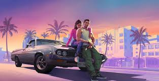

# git-practice-20251C
Trabajo Práctico en Git del Taller

## Índice
1. Habemus Papam
2. GTAVI

# Habemus Papam

## Nuevo Papa en el Vaticano, estadounidense Robert Prevost y se llamará León XIV

- En la cuarta votación del Cónclave los 133 cardenales eligieron al nuevo pontífice.
- A las 14.10 se anunció el nombre y minutos después se asomó a saludar a la multitud.
- En su primer mensaje, llamó a la paz y la unidad y destacó el papado de Francisco.
- Seguí todas las novedades en la cobertura minuto a minuto de Clarín.

El Cónclave eligió al nuevo Papa que sucederá a Francisco al frente de la Iglesia. Se trata del estadounidense Robert Prevost (69), que se llamará León XIV. Un total de 133 cardenales participaron del segundo día de votación y en la cuarta elección se consiguieron los votos necesarios. En su primer mensaje, hizo una llamado a la paz y la unidad y le agradeció al pontífice argentino. Seguí todas las novedades en la cobertura minuto a minuto de Clarín.

### Habemus papam: hubo fumata blanca en el Vaticano y se espera el anuncio del sucesor de Francisco

- El francés Dominique Mamberti tuvo el honor de pronunciar la famosa fórmula latina al final del cónclave.
- Su historia y su relación con el papa Francisco.

Los cardenales no se pusieron de acuerdo en las tres primeras votaciones. Ahora resta conocer el nombre de quién sucederá al último papa

Finalmente, la fumata blanca se hizo presente en el Vaticano este jueves de la chimenea instalada en el tejado de la Capilla Sixtina, señal que los 133 cardenales encerrados en su interior lograron escoger al sucesor del papa Francisco en el segundo día del cónclave.

### La película que marca tendencia con la elección de Robert Prevost como el nuevo Papa

La película "Habemus Papam" vuelve a cobrar sentido tras la elección de Robert Prevost como el nuevo Papa, quien adoptará el nombre de León XIV. Dónde verla.

"Habemus Papam", la expresión latina que anuncia la llegada de un nuevo líder espiritual al frente de la Iglesia Católica ha resonado nuevamente tras la elección de Robert Prevost como el Papa, quien adoptará el nombre de León XIV. La emblemática fumata blanca emergió desde la chimenea de la Capilla Sixtina, marcando el fin de un periodo de incertidumbre tras el fallecimiento del papa Francisco.

La ficción se entrelaza con la realidad en esta comedia dramática que explora con ternura y agudeza el interior del Vaticano durante el cónclave. En medio del encierro sagrado, donde los cardenales deben decidir quién será el nuevo representante de Dios en la Tierra, Moretti plantea una pregunta tan sencilla como disruptiv

a: ¿y si el nuevo Papa no quisiera serlo?

# GTAVI

## Analisis del 2do Trailer

En tan solo 7 horas, el trailer del Grand Theft Auto VI (GTA VI) tuvo 29 millones de reproducciones en YouTube. Un número que lo explica todo: el próximo videojuego de la compañía Rockstar es el que más expectativas genera en el mundo gamer.

El adelanto ahora revela pormenores de la relación entre el dúo protagónico, que será una especie de Bonnie and Clyde modernos. Pero también un detalle que sorprendió refleja todo el poderío visual que tendrá la nueva entrega y que sorprendió a los fans.

## Graficos mejorados

El nuevo trailer muestra los impresionantes gráficos que tendrá al mismo tiempo que revela detalles sobre la trama principal. Podemos observar en el trailer que tan bueno es el motor grafico del nuevo Grand Theft Auto

En una parte del adelanto, si uno observa detenidamente los objetos que hay sobre una mesa y acerca la pantalla verá con lujo de detalles las burbujitas de una botella de cerveza. Esto da cuenta de que Rockstar no dejará pasar nada por alto.

## Nuevos personajes

Los personajes nuevos que aparecen son:
*Lucia Caminos: Rockstar señala que está “recién salida de prisión y lista para cambiar las tornas a su favor”, así como también “decidida a cumplir su plan cueste lo que cueste"

    *Jason Duval: Rockstar señala  que "quiere una vida fácil, pero las cosas no hacen más que complicarse". "Conocer a Lucia podría ser lo mejor o lo peor que le haya pasado. Jason tiene claro cómo le gustaría que acabara la historia, pero ahora mismo es difícil saberlo".

The New York Knicks stunned the Boston Celtics with a dramatic [91–90 victory](https://www.espn.com/nba/game/_/gameId/401769747/knicks-celtics) on May 7, 2025, at TD Garden, taking a commanding 2–0 lead in their Eastern Conference semifinal series. For the second consecutive game, the Knicks overcame a significant deficit to secure the win.
[Trailing by 20 points in the third quarter](https://www.celticsblog.com/2025/5/7/24425712/boston-celtics-blow-20-point-lead-again-lose-game-2-new-york-knicks-91-90-jaylen-brown-jayson-tatum), New York mounted a resilient comeback, outscoring Boston 30–17 in the final period. Jalen Brunson contributed 17 points, including two crucial free throws with 12.7 seconds remaining to give the Knicks a one-point lead. [Mikal Bridges](https://en.wikipedia.org/wiki/Mikal_Bridges), who had a game-winning steal in [Game 1](https://www.espn.com/nba/game/_/gameId/401769746/knicks-celtics), repeated his heroics with another pivotal steal in the closing moments to seal the victory.

# The Players

Josh Hart led the Knicks with 23 points, while Karl-Anthony Towns added 21 points and 17 rebounds. The Celtics, despite strong performances from [Jaylen Brown](https://en.wikipedia.org/wiki/Jaylen_Brown) and Derrick White, struggled offensively, shooting just 25% from beyond the arc and committing 16 turnovers. Jayson Tatum had a challenging game, scoring only 13 points on 5-for-19 shooting.

# Lineups

## New York Knicks
1. O. Anunoby (SF)
2. J. Hart (PF)
3. K. Towns (C)
4. M. Bridges (SG)
5. J. Brunson (PG)

## Boston Celtics
1. J. Brown (SF)
2. J. Tatum (PF)
3. A. Hortford (C)
4. D. White (SG)
5. J. Holiday (PG)

The game was met with mixed reactions from both sides. Knicks fans were ecstatic with their team's resilience and grit, especially considering the challenging circumstances. Analysts praised the Knicks for their composure in the face of a sizeable deficit, with many highlighting their improved defense in the second half as the key to their comeback.

On the other hand, Celtics fans were left frustrated and disheartened. After losing Game 1 in similar dramatic fashion, they hoped for a better result in Game 2 but were left stunned by the Knicks' late-game surge. The Celtics’ inability to close out the game, despite leading by double digits for much of the contest, has raised questions about their consistency and execution under pressure.

The series now shifts to Madison Square Garden in New York for Game 3, where the Knicks will look to extend their series lead. With the Celtics needing to bounce back quickly, the pressure will be on them to regroup and avoid falling into a 3–0 hole. The Knicks’ fans are buzzing with excitement, as their team appears to be in prime position to take control of the series.

